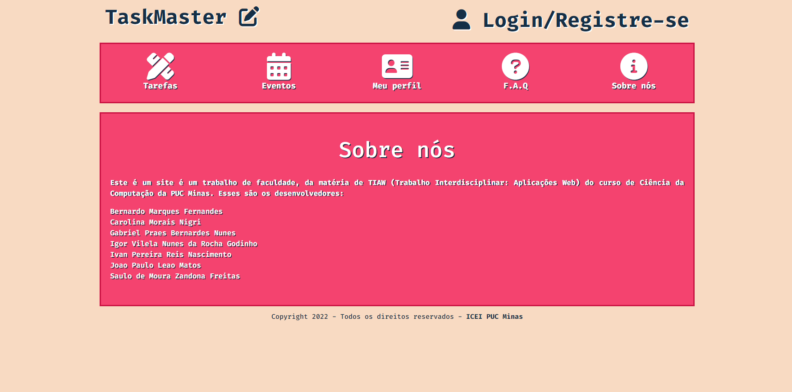

# Informações do Projeto
`TÍTULO DO PROJETO`  

Task Master

`CURSO` 

Ciência da Computação

## Participantes

Os membros do grupo são: 
- Bernardo Marques Fernandes
- Carolina Morais Nigri
- Gabriel Praes Bernardes Nunes
- Igor Vilela Nunes da Rocha Godinho
- Ivan Pereira Reis Nascimento
- João Paulo Leao Matos
- Saulo de Moura Zandona Freitas

# Estrutura do Documento

- [Informações do Projeto](#informações-do-projeto)
  - [Participantes](#participantes)
- [Estrutura do Documento](#estrutura-do-documento)
- [Introdução](#introdução)
  - [Problema](#problema)
  - [Objetivos](#objetivos)
  - [Justificativa](#justificativa)
  - [Público-Alvo](#público-alvo)
- [Especificações do Projeto](#especificações-do-projeto)
  - [Personas e Mapas de Empatia](#personas-e-mapas-de-empatia)
  - [Histórias de Usuários](#histórias-de-usuários)
  - [Requisitos](#requisitos)
    - [Requisitos Funcionais](#requisitos-funcionais)
    - [Requisitos não Funcionais](#requisitos-não-funcionais)
  - [Restrições](#restrições)
- [Projeto de Interface](#projeto-de-interface)
  - [User Flow](#user-flow)
  - [Wireframes](#wireframes)
- [Metodologia](#metodologia)
  - [Divisão de Papéis](#divisão-de-papéis)
  - [Ferramentas](#ferramentas)
  - [Controle de Versão](#controle-de-versão)
- [**############## SPRINT 1 ACABA AQUI #############**](#-sprint-1-acaba-aqui-)
- [Projeto da Solução](#projeto-da-solução)
  - [Tecnologias Utilizadas](#tecnologias-utilizadas)
  - [Arquitetura da solução](#arquitetura-da-solução)
- [Avaliação da Aplicação](#avaliação-da-aplicação)
  - [Plano de Testes](#plano-de-testes)
  - [Ferramentas de Testes (Opcional)](#ferramentas-de-testes-opcional)
  - [Registros de Testes](#registros-de-testes)
- [Referências](#referências)

# Introdução

## Problema

A procrastinação é um grande problema que envolve uma quantidade enorme de pessoas, trata-se do ato de protelar/adiar, onde, muitas vezes, envolve tarefas muito importantes que acabam sendo abandonadas, como um trabalho importante de escola, ou uma tarefa bem requisitada no trabalho. O ato de procrastinar é natural do ser humano, mas ao longo do tempo, esse problema tem se agravado bastante graças ao fácil acesso a distrações, como as redes sociais (que costumam gastar grande parte do tempo das pessoas), séries, filmes, jogos... Além do problema da distração, a falta de organização e planejamento também contribuem muito para que atividades importantes acabem ficando para trás, principalmente no caso de pessoas que tem um tempo restrito para fazer muitas coisas. 

## Objetivos

Nosso objetivo nesse trabalho é ajudar a população que sofre desse problema a se organizar melhor, a se manter motivado a cumprir suas tarefas e a ter um planejamento, como um cronograma semanal ou uma agenda de compromissos interativa, para que assim, essa pessoa possa entender melhor o que fazer, como/quando fazer e ser mais produtiva, conseguindo até mesmo fazer um número de atividades maior em menos tempo.

Tendo isso em vista, o objetivo geral deste projeto é desenvolver uma aplicação Web que auxilie o usuário a se organizar e evitar a procrastinação. Já os objetivos específicos são:
- Fazer com que a tecnologia (computador, celular ou tablet) seja uma forma de resolver o problema da procrastinação, ao invés de ser uma causa dela
- Fornecer uma plataforma de fácil e rápido uso para que o ato de se planejar não se torne uma tarefa que consuma muito tempo e energia do usuário
- Auxiliar, em especial, estudantes universitários a registrarem suas tarefas e cumprirem seus prazos de entrega

## Justificativa

Planejamento e organização são elementos de alta importância na vida humana, especialmente no mundo atual, em que temos uma série de deveres a cumprir para com a sociedade e com nós mesmos, o que nem sempre é alcançado da melhor e mais completa forma. Levando isso em conta, este projeto busca tornar esses elementos mais presentes na vida e rotina daqueles que utilizarem esta aplicação, facilitando a tarefa de fazer planejamentos e se organizar, de forma a tornar isso um hábito e evitar a procrastinação. 

Segundo reportagem publicada na revista Super Interessante, estudos mostram que 20% dos adultos são procrastinadores crônicos, dado que representa, somente no Brasil, cerca de 20 milhões de pessoas. Nesse sentido, consideramos que o jovem adulto, especialmente os estudantes universitários, está entre aqueles que mais procrastinam e sente essa dificuldade em se organizar, visto que este é um público que tem diversas tarefas acadêmicas a realizar e, ao mesmo tempo, quer aproveitar esse período da vida enquanto jovem, sendo, portanto, um bom público a quem se destinar este projeto. 

## Público-Alvo

O público-alvo é, principalmente, estudantes universitários que tem dificuldade de se organizar e manter uma disciplina e estudantes que além de estudar trabalham, necessitando de uma organização melhor do tempo para conseguir realizar todas as suas tarefas. Dividindo o público-alvo trabalhado nesses dois grupos, busca-se observar como eles lidam com a organização e a procrastinação em suas vidas, considerando que, provavelmente, a falta de tempo daqueles que trabalham possa afetar mais sua rotina enquanto outras causas possíveis sejam impedimentos para aqueles que apenas estudam. Observadas as causas e analisando as diferentes rotinas desse público, busca-se oferecer ferramentas que se adequem às diferentes necessidades desses usuários.

 
# Especificações do Projeto

Para a construção do projeto, passou-se por um processo de entendimento e exploração do problema, criando duas personas que representem grupos diferentes dentro do público-alvo escolhido, pensando nas suas necessidades humanas e enquanto usuários. Por fim, enumerou-se os requisitos da aplicação, funcionais e não funcionais, além de restrições para o seu desenvolvimento.

## Personas e Mapas de Empatia

As personas criadas durante o processo de Design Thinking são apresentadas abaixo:

## Histórias de Usuários

Com base na análise das personas, foram identificadas as seguintes histórias de usuários:

|EU COMO... `PERSONA`| QUERO/PRECISO ... `FUNCIONALIDADE` |PARA ... `MOTIVO/VALOR`                 |
|--------------------|------------------------------------|----------------------------------------|
|João Gabriel  | Anotar meus afazeres           | Deixar tudo organizado               |
|João Gabriel  | Organizar minhas tarefas em ordem de importância           | Saber qual que eu tenho de fazer primeiro e quais eu posso deixar para mais tarde               |
|João Gabriel  | Colocar alarmes na hora das atividades           | Seguir os horários e acabar com a procrastinação               |
|João Gabriel  | Ser motivado de alguma forma           | Ter um motivo a mais para eu me organizar               |
|Rafaela       | Registrar minha rotina                 | Me manter organizada |
|Rafaela       | Ter tudo no meu celular                 | Saber o que eu tenho que fazer de forma rápida, sem ter que ligar o computador, porque o celular está sempre comigo |
|Rafaela       | Fazer anotações em cada compromisso                 | Me organizar de uma forma mais precisa |

## Requisitos

As tabelas que se seguem apresentam os requisitos funcionais e não funcionais que detalham o escopo do projeto.

### Requisitos Funcionais

|ID    | Descrição do Requisito  | Prioridade |
|------|-----------------------------------------|----|
|RF-001| Possuir uma tela de login. | ALTA | 
|RF-002| Possuir um sistema de recompensas. | MÉDIA |
|RF-003| Ter um menu inicial com opções de navegacao. | ALTA |
|RF-004| O site deve permitir que o usuário acesse um menu com suas tarefas. | ALTA |
|RF-005| Permitir que o usuário veja e edite suas informações de perfil. | MÉDIA |
|RF-006| Permitir compartilhamento de informações em redes sociais. | BAIXA |
|RF-007| Possuir uma página de comunidade. | BAIXA |
|RF-008| Possuir uma tela de FAQ. | BAIXA |
|RF-009| Permitir acessar informações gerais sobre o site. | MÉDIA |
|RF-010| Permitir configurar notificações. | ALTA |

### Requisitos não Funcionais

|ID     | Descrição do Requisito  |Prioridade |
|-------|-------------------------|----|
|RNF-001| O sistema deve ser responsivo para rodar em um dispositivos móvel | MÉDIA | 
|RNF-002| O site deve ser fácil de navegar. | ALTA | 
|RNF-003| Ser publicado em ambientes de fácil acesso na internet. | ALTA |  
|RNF-004| Ser compatível com os principais navegadores. | ALTA |
|RNF-005| Processar requisitos do usuário em menos de 3s. | BAIXA |

## Restrições

O projeto está restrito pelos itens apresentados na tabela a seguir.

|ID| Restrição                                                                         |
|--|-----------------------------------------------------------------------------------|
|01| O projeto deverá ser entregue até o final do semestre                             |
|02| Não pode ser desenvolvido um módulo de backend                                    |
|03| Devemos ter uma evolução individual semanal en relação ao projeto                 |
|04| O projeto deve ter um foco inicial em ajudar os estudantes que procastinam        |
|05| A equipe não pode subcontratar o desenvolvimento do trabalho                      |
|06| Não podemos ultrapassar os prazos de entrega dos sprints no canvas                |
|07| Inicialmente o projeto deve ser feito em HMTL, CSS e JS                           |
|08| A aplicação deve ser simples e de fácil acesso para o usuário                     |

# Projeto de Interface

A interface da aplicação foi construída de forma a atender à necessidade dos usuários de se registrar as tarefas a serem cumpridas, organizando-as de acordo com seus respectivos prazos e níveis de prioridades. Para tanto, a página permite ao usuário cadastrar seu perfil e acompanhar sua fila de tarefas, além de possibilitar uma integração com a comunidade, FAQ e compartilhamento em redes sociais.

## User Flow

O diagrama abaixo apresenta o fluxo do usuário na aplicação:

## Wireframes

Os wireframes apresentados abaixo representam a página inicial e a página da fila de tarefas da aplicação:

# Metodologia

A metodologia para a produção deste projeto se baseia no Design Thinking, processo utilizado para entender, explorar e materializar o problema e sua solução. Além disso, foi adotada a metodologia ágil do Scrum para a organização da equipe e gerenciamento do projeto, assim como o controle de versão usando Git hospedado no GitHub com a metodologia Git Feature Branch Workflow.

## Divisão de Papéis

Adotando a metodologia ágil Scrum, a equipe será dividida segundo os seguintes papéis:

- Scrum Master: Carolina Morais Nigri
- Product Owner: João Paulo Leao Matos
- Equipe: 
  - Bernardo Marques Fernandes
  - Gabriel Praes Bernardes Nunes
  - Igor Vilela Nunes da Rocha Godinho
  - Ivan Pereira Reis Nascimento
  - Saulo de Moura Zandona Freitas

## Ferramentas

Ferramentas empregadas no projeto:

- Miro, para o Processo de Design Thinking: facilidade de edição simultânea e em equipe
- GitHub, para o Repositório de código: ferramenta muito utilizada por facilitar a colaboração e compartilhamento do código pela equipe
- Creately, InVisionApp e Photoshop, para o Projeto de Interface: as duas primeiras pela facilidade de uso e a última por haver afinidade de uso por membro da equipe. São ferramentas bastante versáteis e flexíveis, dão uma boa agilidade para produzir um resultado satisfatório de forma rápida. O Photoshop, apesar de não ser tão prático e fácil de usar, é uma ferramenta de infinitas possibilidades de resultado gráfico, que demanda mais tempo de trabalho mas funciona muito bem. 
- Trello, para o Gerenciamento do Projeto: escolhida por haver afinidade de uso por membro da equipe e possuir funcionalidades muito úteis para a organização da equipe, permitindo, por exemplo, a atribuição de tarefas para cada membro, a determinação de prazos e a categorização por meio de etiquetas

| Ambiente  | Plataforma              |Link de Acesso |
|-----------|-------------------------|---------------|
|Processo de Design Thinking  | Miro |  https://miro.com/app/board/uXjVOB6EAuA=/ | 
|Repositório de código | GitHub | https://github.com/ICEI-PUC-Minas-PMGCC-TI/tiaw-pmg-cc-m-20221-procrastinacao-2-t2-g7 | 
|UserFlow | Creately |  https://embed.creately.com/DmH9egf6F2W?token=DWEE2GmCAIjWwL5N&type=svg | 
|Wireframe | InVisionApp | [encr.pw/Epyek](encr.pw/Epyek) [encr.pw/Pq7fa](encr.pw/Pq7fa) | 
|Gerenciamento do Projeto | Trello | https://trello.com/b/JfWIrgmI/gest%C3%A3o-do-projeto |  

## Controle de Versão

O controle de versão será feito utilizando o Git hospedado no GitHub, adotando a metodologia Git Feature Branch Workflow. 

As tags serão usadas para nomear versões funcionais da aplicação, verificadas a partir dos testes a serem feitos.

As branchs serão feitas da seguinte forma: a partir da `master`, a branch principal, será criada a branch `dev`, onde será feito o desenvolvimento, e a partir desta serão criadas as branchs `feature`, para as funcionalidades a serem desenvolvidas. Após serem testadas, as `feature` farão merge na `dev`, e quando terminado o desenvolvimento, retornarão à `master`. 
- `master`: parte estável do projeto 
- `dev`: partes do projeto em desenvolvimento
- `feature`: funcionalidades em desenvolvimento

As issues seguirão a seguinte convenção:
- `bug`: apontar erros e problemas na aplicação
- `enhancement`: sugerir melhorias para a aplicação
- `feature`: propor novas funcionalidades para a aplicação

# Projeto da Solução

**TaskMaster**

## Tecnologias Utilizadas

As linguagens usadas para a programação do site foram HTML, CSS e JavaScript. Utilizamos muitas ferramentas: Miro, GitHub, Visual Studio Code, Replit e Trello (que não usamos tanto quanto os outros), e para comunicação utilizamos o Whatsapp e o Discord. Usamos os seguintes sites de apoio: Font Awesome, Google Fonts, o framework Booststrap, além da biblioteca jQuery.

O Miro e o Trello foram usados para o planejamento do projeto, no início do trabalho. O GitHub para a documentação do projeto, o VSCode para a programação das páginas em si, e  o Replit para a hospedagem do site. Fizemos chamadas pelo Discord para resolver assuntos do trabalho e no Whatsapp, fizemos um grupo para nos comunicarmos mais facilmente. O Font Awesome, Google Fonts, o framework Booststrap, e a biblioteca jQuery foram utilizados na hora da programação das páginas, para melhorar tanto estéticamente quanto interatvamente.

**User Flow**

Esta página abaixo é a principal/inicial do site, onde é falado um pouco sobre procrastinação, fala sobre o que é procrastinação em si e algumas causas dela.
Na parte de navegação (parte de cima do site) há 8 possibilidades e é importante dizer que essa aba é a mesma em todas as páginas do site. Se você clica em "TaskMaster" você é direcionado para essa página inicial. "Login" te leva para a parte de login, "Registre-se" te leva para a parte de cadastro de usuário. Essas três páginas estão abaixo. Importante dizer que apenas depois de cadastrado e logado, é possível acessar as páginas de tarefas, eventos, perfil e consequentemente da loja de recompensas.

**Página principal**

**Página de login**

**Página de cadastro**

Abaixo está a página de tarefas, onde você pode cadastrar seus afazeres cotidianos, excluir e alterar suas tarefas.

**Página de tarefas**

Esta é a página de Eventos, que foi feita para você organizar seus eventos, que não são cotidianos, mas você quer deixar anotado em algum lugar para não esquecer.

**Página de eventos**

Esta é a página de perfil, bem simples, que contém seus dados.

**Página de perfil**

Apenas através da página de perfil é possível acessar a loja de recompensas, que nela você pode alterar a cor de fundo, estilo e cor da fonte.

**Página da loja de recompensas**

A página abaixo é a de FAQ, onde algumas dúvidas acerca do site são tiradas. 

**Página de FAQ**

E esta é a última página, que fala sobre nós, os criadores do TaskMaster.

**Página sobre nós**

## Arquitetura da solução

O HTML, CSS e JavaScript foram usados em conjunto para fazer a programação do site em si. Foi mandado para o Local Storage o registro das tarefas/eventos cadastrados pelo usuário e também o cadastro do próprio usuário. Daí foi mandado para a Internet, e hospedado no site do Replit, que é um site que permite que os usuários criem projetos e escrevam código em várias linguagens.

 

# Avaliação da Aplicação

Nossa aplicação é composta por páginas estáticas de informações que podem ser acessadas sem estar logado ou registrado no site, como página inicial, F.A.Q. e Sobre nós, que podem ser visualizadas clicando, respectivamente, na logo do site e nas opções do menu. Além disso, ao criar uma conta e logar, o usuário pode acessar páginas dinâmicas, como Tarefas, Eventos, Meu perfil e Loja de Recompensas. Nas páginas citadas, o usuário poderá cadastrar, alterar e excluir seus eventos e suas tarefas, ganhando pontos ao concluí-los, que podem ser usados na Loja de Recompensas, sendo que todas essas informações ficam salvas localmente em sua conta. 

## Plano de Testes

|#| Cenário | Pré-Condições | Ações |
|--|--------|---------------|-------|
|1| Abertura do Site | Em um desktop, notebook, celular ou tablet | Conferir a visualização da página |
|2| Menu | Visualizar parte de cima do site dedicada a abrir novas páginas | Clique em qualquer uma |
|3| Cadastro de Usuário | “Login/Registre-se” | Clique na opção de “Login/Registre-se” |
|4| Eventos | Estar logado e abrir a página de Eventos no menu | Cadastrar, alterar ou excluir eventos |
|5| Tarefas | Estar logado e abrir a página de Tarefas no menu | Cadastrar, alterar ou excluir tarefas |
|6| Sistema de Recompensas | Estar logado e abrir a página de Eventos/Tarefas no menu | Concluir eventos/tarefas |
|7| Loja de Recompensas | Estar logado e abrir "Meu perfl" | Clicar em "Loja de Recompensas" |

## Registros de Testes

|#| Cenário | Resultados | 
|--|--------|---------------|
|1| Abertura do Site | Encontrará um site com uma página inicial informativa, menu com opções para clicar e possibilidade de se logar/registrar como usuário, responsivo e bem organizado |
|2| Menu | Será redirecionado para a página da opção que clicou |
|3| Cadastro de Usuário | Será redirecionado para a página de login ou de registro, podendo armazanar seus dados localmente |
|4| Eventos | A visualização na tela de eventos será alterada, removendo eventos concluídos, adicionando eventos cadastrados e modificando eventos alterados |
|5| Tarefas | A visualização na tela de tarefas será alterada, removendo tarefas concluídas, adicionando tarefas cadastradas e modificando tarefas alteradas |
|6| Sistema de Recompensas | Ao concluir um evento ou tarefa, os "taskpoints" do usuário serão alterados |
|7| Loja de Recompensas | Será mostrada a loja de recompensas, com a "taskwallet" do usuário e seus "taspoints", que podem ser usados para comprar estilos diferentes para a página |

# Referências

- [Procrastinação: como mudar o hábito de procrastinar?](https://www.vittude.com/empresas/procrastinacao/)
- [Fluxo de trabalho de Gitflow](https://www.atlassian.com/br/git/tutorials/comparing-workflows/gitflow-workflow)
- [Scrum — o que é, como funciona e por que é incrível - Atlassian](https://www.atlassian.com/br/agile/scrum)
